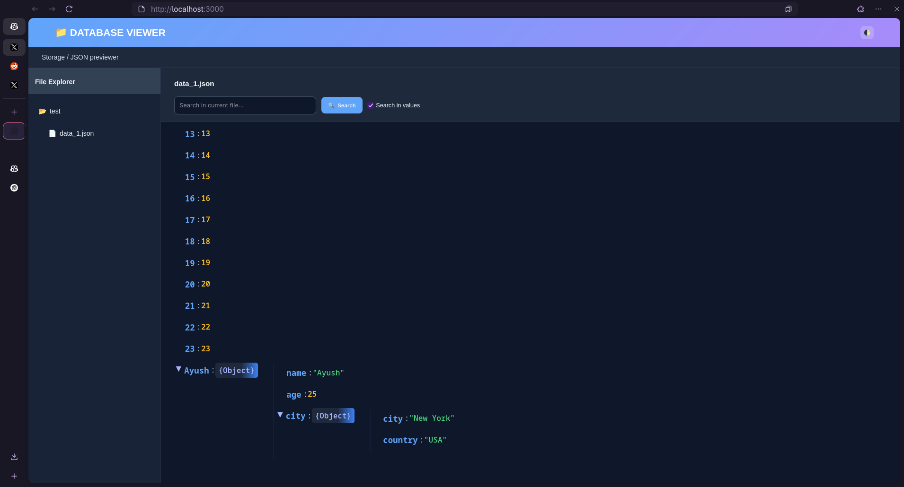
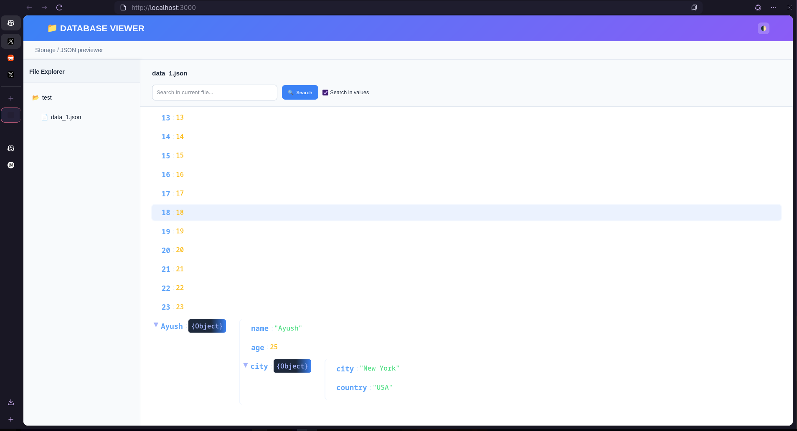
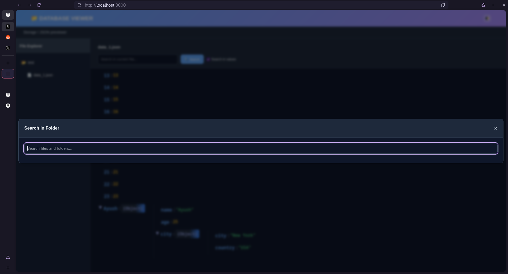
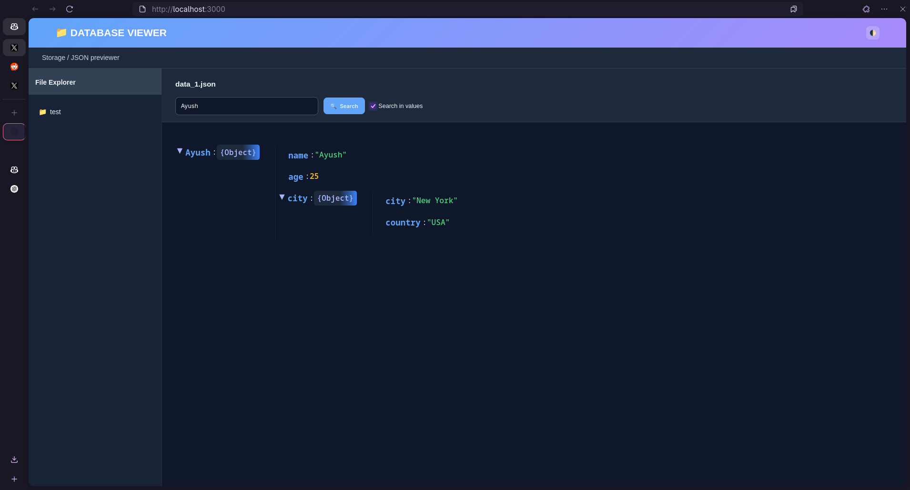

# Database Viewer

> **View, search, and explore your JSON database files with a beautiful, blazing-fast UI.**

[](./LICENSE)
[](https://github.com/grdAyush/Database-Viewer/stargazers)
[](https://github.com/grdAyush/Database-Viewer/issues)

---

## 🚀 Features

- **Instant JSON Preview:** View your database files in a clean, expandable tree.
- **Powerful Search:** Find keys, values, or files instantly—supports in-file and folder-wide search!
- **Modern UI:** Responsive, dark/light theme, smooth animations, and keyboard accessibility.
- **Folder Tree Navigation:** Browse your data by folders, with collapsible nodes and search in any folder.
- **No Vendor Lock-in:** Works on your local machine, with your own JSON, securely.
- **Open Source & Customizable:** MIT licensed, easy to extend for your needs.

---

## ✨ Demo

<video src="./assets/demo.mp4" controls width="600">
  Your browser does not support the video tag.
</video>

<sub>Video Demo Of The Website</sub>

---

## 🛠️ Getting Started

### 1. Clone the Repo

```sh
git clone https://github.com/grdAyush/Database-Viewer.git
cd Database-Viewer
```

### 2. Add Your JSON Files

Put your JSON database files and folders inside the `storage/` directory.  
**Example:**
```
storage/
  users.json
  products/
    books.json
    electronics.json
```

### 3. Install Dependencies

```sh
npm install
```

### 4. Start the Server

```sh
npm start
```

- The app will run at [http://localhost:3000](http://localhost:3000)
- Open in your browser to enjoy the UI.

---

## 📂 Project Structure

```
.
├── storage/         # Your JSON database files go here
├── public/
│   ├── index.html   # Main frontend app
│   ├── style.css    # All UI styling (dark/light, responsive)
│   └── script.js    # UI logic & interactivity
├── index.js         # Express backend server
├── package.json
└── README.md
```

---

## 🎨 UI Highlights

- **Sidebar Folder Tree:**  
  Quickly browse nested folders and files with instant visual feedback.

- **File Preview Panel:**  
  Beautiful JSON tree viewer, supports collapse/expand, color-coded types, and large files.

- **Search Experience:**  
  - Global search: files, folders, and keys (with fuzzy matching)
  - In-file key/value search
  - Highlighted results
  - Keyboard and mouse support

- **Theme Toggle:**  
  One-click dark/light mode. Remembers your choice.

- **Responsive & Accessible:**  
  Mobile-friendly layout, ARIA labels, semantic HTML.

---

## ⚡ Screenshots

<p align="center">
  
  
  
   
</p>

---

## 🧑‍💻 Development

- Built with **Node.js**, **Express**, and modern **vanilla JS/CSS/HTML** (no frameworks).
- Zero tracking, zero analytics, 100% privacy.
- Easily extend: add new features, support other formats, or customize the UI.

---

## 🤝 Contributing

Pull requests, feature suggestions, and bug reports are welcome!

1. Fork the repo & create a new branch (`git checkout -b feature/my-awesome-feature`)
2. Make your changes
3. Submit a Pull Request with a clear description

---

## 📄 License

[MIT License](./LICENSE)  
© 2025 [Ayush (grdAyush)](https://github.com/grdAyush)

---

## 🙏 Credits

- Designed and developed by [Ayush](https://github.com/grdAyush)
- UI inspiration from modern IDEs and database tools
- Thanks to the open-source community

---

> _If you like this project, please ⭐ star the repo and share your feedback!_